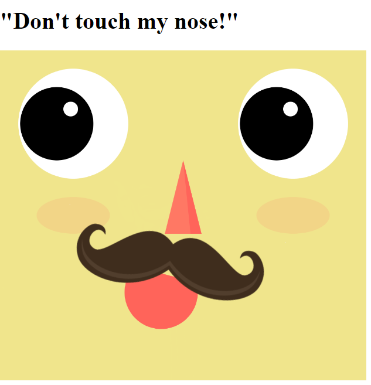
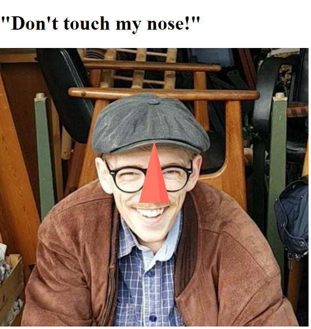

# MANISFEST OF MOUSTACHES

 

**URL:** https://rawgit.com/Margretexie/Mini_ex/master/mini_ex2/empty-example/index.html

## So, this happened...
A lot has happened since my last code. This code is actually just a huge upgrade of my [mini_ex1].(https://rawgit.com/Margretexie/Mini_ex/master/mini_ex1/empty-example/index.html)

**Dynamics**

With the help of setting *variations* (speed and pupilsX/Y) and *"if*-statements" the eyes of the man now moves from side to side. 

**Interactivity**

And with the help of *AND, OR, ELSE* statements there's now also a roll-over effect on the man's nose.

And with the *mousePressed* function the nose has become a botton that triggers the **MANIFESTATION OF MOUSTACHES**, where the code picks a random photo of a famouse person with a beautiful moustache. There are preloaded 19 photos, and I've made sure that the noses of these people are at the same spot as the nose of the drawn man (this step took a great deal of time to complete).

## FUN!
Fun of geekiness: It has been so much fun in making this code. Exploring and trying out new functions, making sense of the codes, failing  a bunch of times and being very excited and happy when it finaly succeeds!  

Fun of surprises: For the user I imagine there would be some kind of fun in the surprise of seeing random photos when the nose is clicked.

Humor: Admit it, moustaches are just funny things. Moustaches can express a lot of different things about a man: confidence, sophistication, man-hood, open personality, beauty... But it can also trigger more negative expressions as goofyness, perverted (pedo-stach), evil...

I hope this code can trigger a smile on you're face, and maybe a change of mindset around moustaches? 
