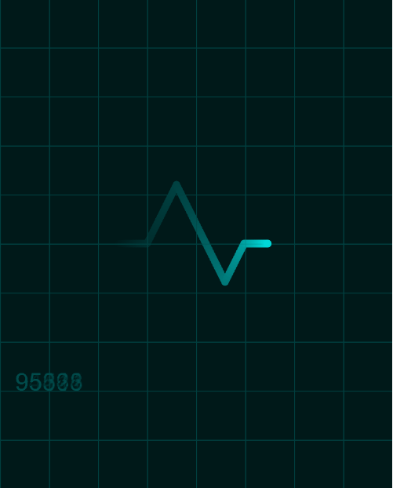

# Heartbeat monitor throbber

 

**URL:** https://rawgit.com/Margretexie/Mini_ex/master/mini_ex3/empty-example/index.html

# The Technical Stuff
Well... This piece of code is actually REALLY simple compared to my last mini_ex. The throbber itself only contains an ellipse that moves to the left by a constansly increasing x-position (xPos = xPos + speed). At sertain x-positions the throbber will go up or down, this is made by an if-statement that changes the y-position according to the specific x-position. And finally when the throbber reaches 400 (which is the width of the canvas) it resets back to 0.

In order to make the "trail" or "fade" effect behind the throbber, I used Winnie's technique of adding a dark half-transparent rectangle in the draw function. This half-transparent rectangle will cover the previously drawn ellipses and "trick" the eye to see a trail behind the ellipse in the front.  

This is all very basic...

So I added some stuff to challenge my new knowledge from the latest lecture: for-statements and millisecond counts.
With for-statements I managed to create a "grid" in the background, just like real heartbeat monitors have. This for-statement creates a vertical and horizontal line every 50 pixels and saves me a lot of work and time drawing lines. (I do have a problem with setting the grids behind the throbber trails though...)

The millisecond thing was just added to try it out, but it does contribute to the idea of a real heartbeat monitor where the bpm (beats per minute) is usually counted in the corner.

# The Deep Stuff
#### What is the time-related syntax/function that you have used in your program? and why do you use in this way?
The fact that the ellipse is moving in a constant speed, it resets back to 0 and starts over and over again and the milliseconds counted in the corner shows us that this piece of code is time-related. 

BUT

I think it also shows us much more then that. By being dynamic and continous it shows us that the machine is working, and maybe even "alive"? It makes me wonder: Humans need their heartbeats going in order to stay alive, what about computers? Are they heartless? Can we given them a heart?

#### Think about a throbber that you have encounted in digital culture e.g streaming video on YouTube or loading latest feeds on Facebook or waiting a ticket transaction, what do you think a throbber tells us, and/or hides, about? How might we think about this remarkable throbber icon differently?
Throbbers are there to entertain us with something dynamic while we wait, it's like taking our focus somewhere else so we can forget about the time wasted (We get distracted by throbbers like babies or cats getting distracted by moving objects). 

But the annoying thing about throbbers are, that they tell us either of these two things: I'm working on something really hard so this might take a while. Or. I'm not really working because something's wrong. You'll never know... But in the last case, THANK GOD some genius came up with the idea that the throbber should stop entertaining us after a sertain amount of wasted time and tell us if something is wrong.

Some throbbers also has a function of advertisement, like Google's throbbers always has the same colors as their logo:
[This.](https://dribbble.com/shots/1191457-Dots-Throbber)   
[Or this.](https://dribbble.com/shots/1198509-Google-Plus-Like-Loader)
[Or even this.](https://giphy.com/gifs/little-mix-icons-Ne0tAkq2Ku2w8)

Or this one from Alternativet which is just their [logo spinning around itself](https://alleos.alternativet.dk/user/3980)

This has led to some more interesting throbbers than the normal gray-dots-spinning-around-and-driving-you-crazy-throbber. My favorite so far is the [cute octopus throbber](https://imgur.com/gallery/r3PStS5). And I think every throbber should be this unique and fun!
