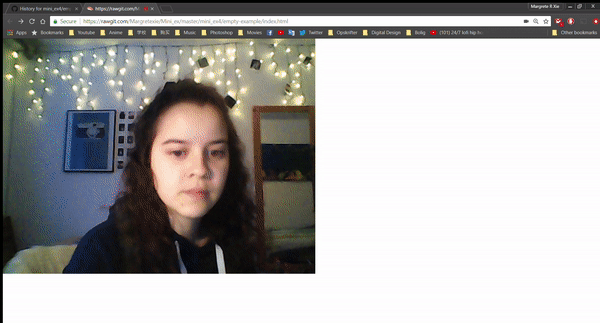

# Data Capture
 

NOTE: For best experience please be in a bright room, and preferably take your glasses of.
Try moving away from the computer or hide your face.
[Try it out.](https://rawgit.com/Margretexie/Mini_ex/master/mini_ex4/empty-example/index.html)

# So what's this?
This mini_ex captures if anybody is sitting in front of the computer. When it doesn't detect anybody it shows a bunch of 0s and 1s.

Technically this is a fairly simple code. I used createCapture(VIDEO) to start the webcam. To track movement in front of the webcam I downloaded the clm.tracker and referenced to it in the HTML source code. With this I can now use the getScore() element to set the sensitivity of the webcam. When it detects a face which is a perfect fit to the face model, the score will be 1. And when no face is detected the score will be 0. In my code I've told the program that if the score(I've called it 'movement') is under 0.5 it shall draw either a 0 or 1 at a random position on the canvas. This is made by an if-statement and an array from which it chooses 0s and 1s randomly. The 0s and 1s are green and the background is black. This is done to create a kind of "Matrix" effect. When the score is over 0.5 it clears the canvas.

By the help of console.log I tested if the face tracking was working when i first initialized it. Later on I used it to find out how high the score should be in order to catagorize when the computer do/do not recognized a face.

The face tracker is a bit slow and buggy though. So the program is not 100% optimal, but I hope you get the idea. I did try to figure out if there was another library I could use instead of the face tracker. Like a tracker that only tracks movements without a dependence of a face. But I didn't find any, maybe I just didn't dig deep enough into the web. If this could be found the program would work more optimal.

# So what's the point?
### How might this ex helps you to think about or understand the data capturing process in digital culture?
This mini_ex shows us that the computer is ALWAYS watching you, and it knows whether you're in front of it or not because it's constantly collecting data about you even when you're not looking.
its super creeeeeeeeppyy
