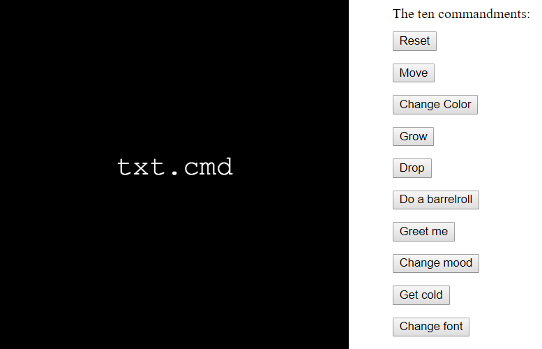
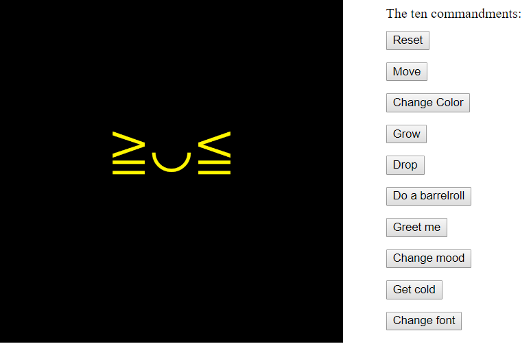
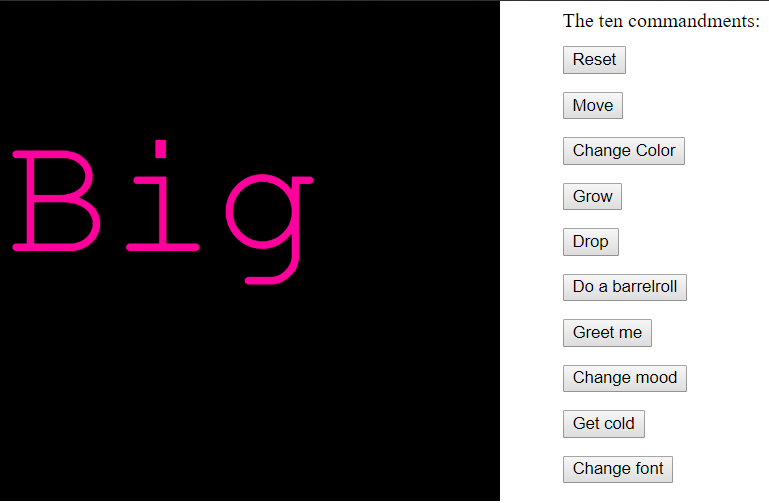

# txt.cmd - CODE IS LAW (In collaboration with …)
 



[Try out code now](https://rawgit.com/Margretexie/Mini_ex/master/mini_ex7/empty-example/index.html)

# E-litterature
This weeks theme is e-litterature that utilizes written text/audio text as the main medium to convey a kind of message. 
# Our Program
## Technical aspect 
This is a program that contains a canvas, a text object and 10 different buttons with each their functions that affects the text object. We chose to use object oriented programming so we could easily manipulate with the objects attributes under the different circumstances. As seen in the code ``txt.text=’...’`` is a syntax we’ve used several times, since the text is the main object of the program. Other attributes we’ve manipulated with are ``txt.color, txt.ypos/xpos, txt.size, txt.font`` and so on.

Another big aspect of the program is the 10 buttons. We’ve created if-statements to decide whether the buttons are pressed, not pressed(or in some cases pressed second time). This is done by Boolean statements (true/false), in our case we’ve used the numbers 1 and 0 to check if the statements are true or false. 
``` javascript
function txtdrop(){
  if (drop == 0){
    drop = 1;
    dropst = 1;
  } else{
    drop = 0;
  }
}
```
A more detailed description of the code’s different parts is commented inside the code.

## Conceptual aspect
Our program was inspired by the notion of “executive code”, how language becomes executable in code and becomes actions of the programmers wish. This reminded us of the notion of “Code is law” and The Word:
>"In the beginning was the Word, and the Word was with God, and the Word was God" (John, 1:1,)

In our program you interact with a text-object by using 10 buttons, labeled ‘The 10 commandments’ on the right side. 

In a way it feels like you are commanding the computer to do certain things by using english language instead of programming languages.  In this perspective you become the Word, the God that commands the computer to do certain things. In its strong believe in you it does whatever you tell it to without hesitation. The fact that we've used object oriented programming also supports the idea of us "playing Gods" who manipulate the computer which is merely an object or a "puppet".

Each command button makes the text-element perform an action but also react on that action much in the same way as a human would. This feedback gives the computer a form of voice or personality. Reacting on things like being dropped on the ‘ground’ by writing **Hurt** or changing color by writing **Pretty**. This gives an idea of humanizing the computer and hiding the fact that the program is just following rules and algorithms.

# Vocable Code and our program
*What is the aesthetic aspects of your program in particular to the relationship between code and language?*

This program is showing us how the computer's language is an executable language. And how the program is telling us what it's doing on the exact moment it's doing it. As Geoff Cox states:
> "Programs are operative inasmuch as they do what they say, but moreover they do what they say at the moment of saying it" (p.35 Vocable code by Geoff Cox)
In our program it's *literally* telling us what it's doing by changing text: Like when it's moving, it's also telling us that it's moving by displaying the text "Moving".

Furthermore the program also shows us how the computer is executing *precisely* as we tell it to - no more and no less. The computer does not have the capability to "think creatively" our "think outside the box" like we have. When we speak, we can have several different ways to express the same meaning. We can add some fancy words to give a sentences new dimensions or another tone. But the computer is so logical and algorithmic, that it's only capable of saying or expressing *exactly* what we tell it to. Like Florian Cramer says:
> “Writing in a computer programming language is phrasing instructions for an utter idiot.” (Florian Cramer, “Language”, in Fuller op. cit., p.171)

When we speak, we automatically also consider the social surroundings we're in. We carefully pick out the words we're going to use according to what we're talking about, who we're talking to and when we're talking. Grammatical rules do give us a basic structure of how we speak, but other than that we're free to choose whatever words we want to express ourselves. The computer on the other hand doesn't care that much of the meaning of words, they just see it as symbols in a sequence:
> "The meanings of words are not derived from an inherent logical structure alone that manipulates symbols into particular sequences (like a program), but also from their social usage." (p.32 Vocable code by Geoff Cox)

Some of the elements of our program is based on our human perception. Like the fact that the computer can "change mood" or "freeze". These are human attributes that we all know about and thereby we create a "lively" program as if it had feelings and a body like us:
>"Programmers bring bodily meaning to their work by applying models of human perception, and by trying to account for the ways that other social bodies are drawn into the process of meaning production"(p.26 Vocable code by Geoff Cox)
Another example is: When the program says "dropping" we immediately understanding it as moving downwards because of gravity. But since there's no gravity in the program we've actually just created a fake simulation of what we understand as dropping and put it in the code. 

