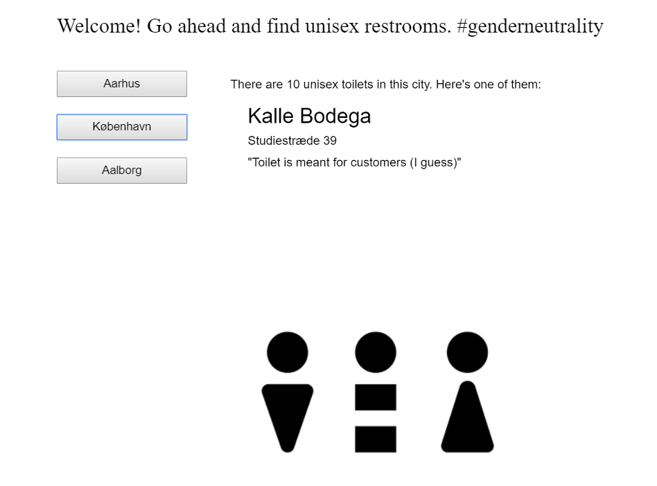
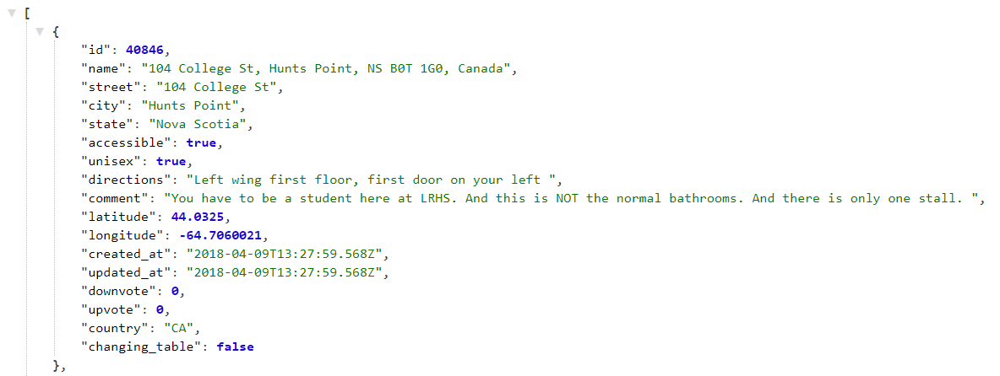

# UTOPIA (Unisex Toilet Overview Providing Internet Application) - In collaboration with Nanna N
 
[FIND YOUR REFUGE HERE](https://rawgit.com/Margretexie/Mini_ex/master/mini_ex8/empty-example/index.html)

## Concept:
The program is a quick overview of where you can find unisex toilets in the three biggest cities in Denmark. It provides you with information about the toilet’s location, address and if needed a comment possibly made in collaboration with users of LGBTQ+ communities. It also tells you how many toilets in total, that are to be found in the given city that are clicked.   

All this information is provided to us through an API from [Refuge Restrooms](www.refugerestrooms.org/). We’ve wanted to make a program with a political statement. Through our program we’ve raised awareness to the numbers of unisex toilets in Denmark. These numbers are low in general, and this can cause problems for the LGBTQ+ community members. Furthermore, the information can maybe be of help for those who seek unisex toilets.
## Technical:
The data from the API is determined by location - longitude and latitude - therefore, we created variable that contains the specific longitudes and latitudes of the three cities. 

At first we thought that we could make a search bar, where you could write the name of the city - we could therefore make a program that provides information of the whole world. But because of the way the location is defined by longitude and latitude, we had to simplify our work by limiting our program to only count in the three big cities of Denmark. 

We had some problems with using the API data, because it seemed like it wouldn’t update the data when the API changed (when choosing between the cities). So we made an extra function called ´update data´ which will store the new API and thereby work as a step between clicking the buttons and showing the data.

Additional technical aspects of the program is commented in the code.

## Reflections
*Can you describe and reflect your process of making this mini exercise in terms of acquiring, processing, using and representing data? How much do you understand this provided data? How do platform providers sort the data and give you the selected data?*

We used about an hour to search the internet for APIs and come up with ideas. There were surprisingly many APIs out there, some were more useful than others. But the most useful and interesting ones (API from Twitter, Facebook and other big companies) all required OAuth, which Nanna and I already decided to avoid from the beginning since it would take a lot more effort and time. We sorted the API we found that were interesting and easy to use, and at last we chose this one to work with. Their development page was very useful and beginner friendly. They had the "Try it out" page where you can plot in requests (like location, key words, result pr page...) and they will show you the data they've got. This was great for us to get an insight to what the data contained and thus gave us ideas of how we could use the data. We were surprised to see how few unisex toilet there were in Aarhus and decided that we wanted to make a program that criticized this fact and at the same time be practical to some (Nanna pointed out that all her other miniexs were useless silly programs, and therefore she wanted to make a more serious program). 

I think I've got a pretty good grasp on how API data work, but the hardest part (in our case) was to use it. At times it was hard to get the program to represent the right data. Not because we couldn't reference to the right path/directory of the data, but because we struggled with the buttons that were supposed to update the data for everytime you click on it. It took us a lot of time and effort to come up with the idea of creating a new function with the purpose of updating the data before representing it on the canvas. 

The data we found were obviously created by a community of people since there were personal comments and additional directions to the specific toilets. But this of cource has its flaws: maybe there are more unisex toilets in Aarhus than what the data shows, but maybe they're just not explored by anyone from this particular community yet. I tried to figure out how to become one of the community and how to provide and contribute data for them, but it was not obvious enough for me to figure out how to do so. The platform provider could maybe fear an abuse by opening up the community for everyone? In the data we found, there were also "upvotes" and "downvotes"(see image below) from users. This might have helped the platform providers to sort their data and figure out whether the information provided by the users are true or not.
 

*Try to formulate a question in relation to web APIs or querying processes that you want to investigate further when you have more time.*
How much influence do web APIs have on software development? Does it liberate developers or confine them?
