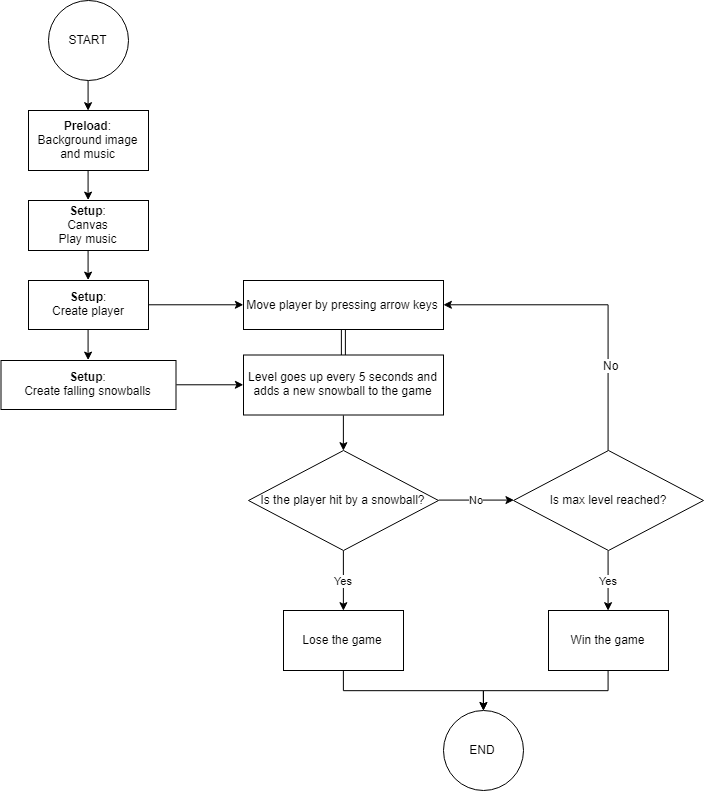
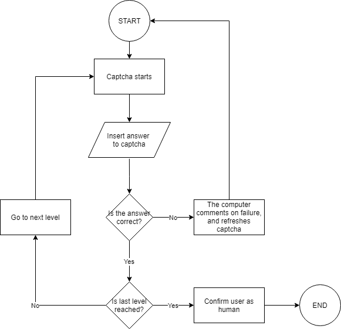

# Flow charts
### Individual work:
Here's the flow chart of my [mini_ex5](https://github.com/Margretexie/Mini_ex/tree/master/mini_ex5) where the topic was Object Oriented Programming. In this mini_ex I've made a game where the goal is for the player to survive the falling snowballs as long time as possible, and as time goes it gets harder and harder to survive.

 

It was very hard to figure out which elements of the program to include and exclude in the flow chart. It was all about abstracting what might be important and what might not be important in order for the reader to understand the program just by looking at the flow chart.
Some of the considerations were: should I introduce the two different objects(the player and snowballs) of the program? Is it relavant to include the background music and picture in the flowchart? How technical should I be in the flowchart? 

Something else that was hard was to playce the blocks of the flow chart tactically - how do I make it easiest for the reader to understand the flow chart? In my flow chart there are two things going on simultaniously: the player is moving while the leveling system goes up every 5 seconds. These two thing were very different from each other, but because they were happening at the same time, I chose not to draw an arrow between them but a double line. This is to indicate that they are happening at the same time, but I'm not sure if the reader understands it the same way I do.

### Group work:
 

 
